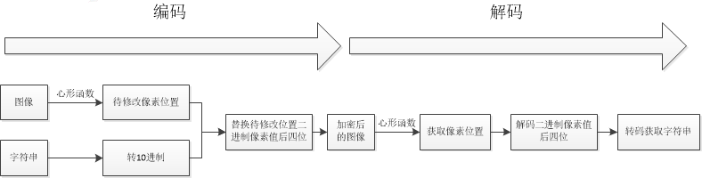

# 图像隐写小工具


## 关键特性

- 将字符串信息隐写到图片。
- 只支持png图片。
- 请参考[知乎](https://zhuanlan.zhihu.com/p/98081137)。

### 环境要求
- Python环境：python 3

### 运行示例
```bash
cd src
data = ImageSteganography()
data.image_encode('明晚3点老地方见', '../image/1.png', 'image_hide/')
print('隐藏字符是：'+data.image_decode('image_hide/1.png'))
```
### 结果
图中包含信息

